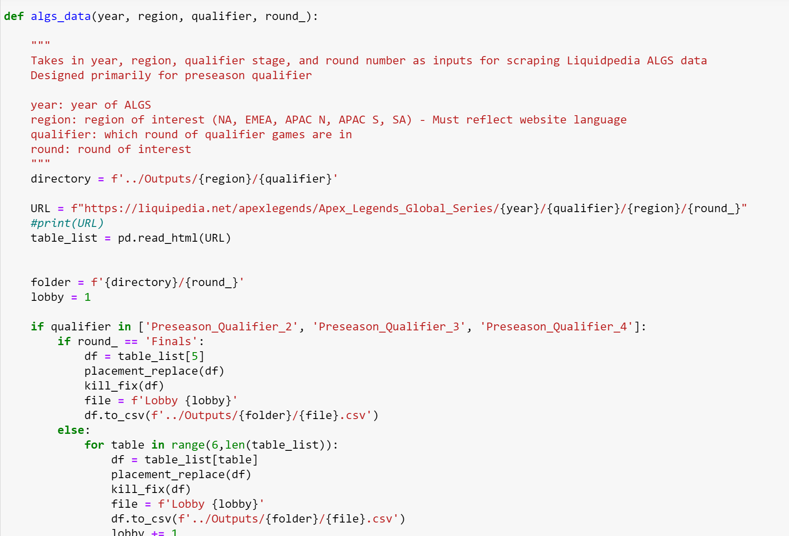
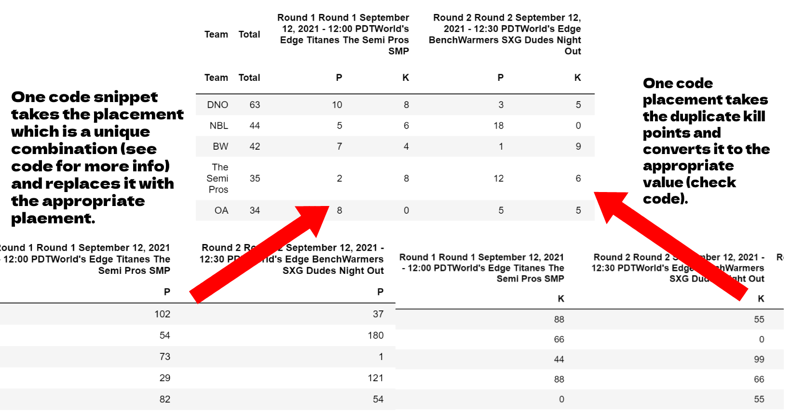
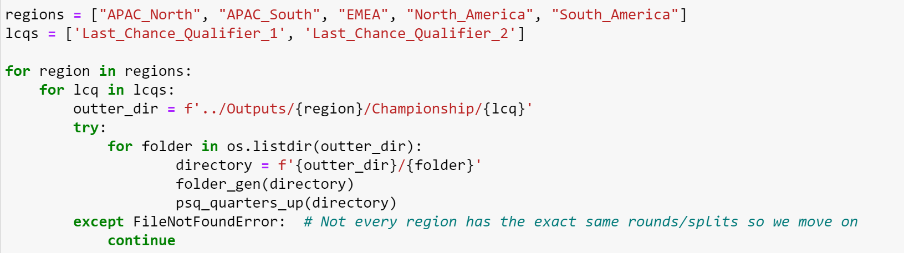
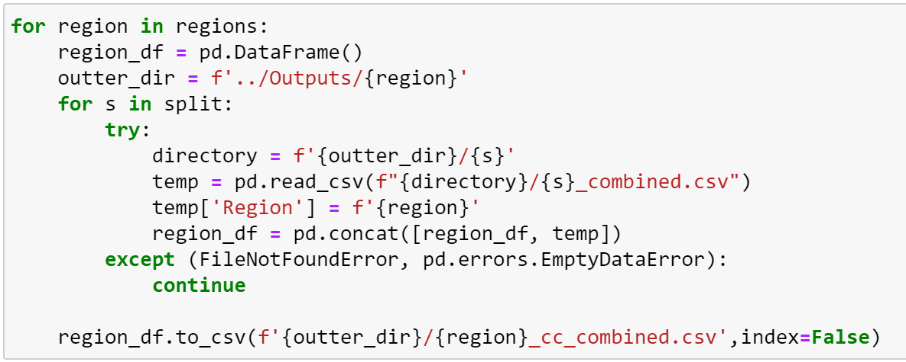

  

# Apex Legends Global Series Data Scraping Project

This project scraped web data from the Apex Legends Global Series (ALGS) Year 2 (spanning 2021-2022) season for the purposes of data visualization and submission into the IronViz competition.

The data is openly available on [Liquidpedia ALGS 2021-2022 Data](https://liquipedia.net/apexlegends/Apex_Legends_Global_Series/2022/Championship). I scraped the data for the purposes of creating visualizations in Tableau. The final visualization can be found at the following link to my [IronViz Tableau Public link](https://public.tableau.com/app/profile/timothy.lu3564/viz/TimothyLu_ALGS_IronVizFinal/algs?publish=yes).

## ALGS Overview

The ALGS tournament is played in the game Apex Legends, an on-line Battle Royale developed by Respawn and published by Electronic Arts. This tournament has multiple stages held on-line in multiple regions simultaneously leading up to 2 major in-person LAN tournaments. 

The 5 major regions are: North America, South America, EU/Middle East, Asia-Pacific North, Asia-Pacific South.

There are 4 major components in ALGS:

|  ALGS Stage        |                    Amount of Games           |
|:------------------:| :-------------------------------------------:|
| Preseason Qualifier| Multiple weeks of gaming to qualify          |
| Split 1            | Challenger Circuit, Playoffs, Pro League     |
| Split 2            | Challenger Circuit, Pro League, LAN Playoffs |
| Championship       | Last-Chance Qualifier, LAN Championship      | 

To collect the data efficiently, I started by breaking down the overall structure of the ALGS tournament then took a methodical approach to collecting the data. This leads us to the process of data scraping.

## [Data Scraping Process](DataScrape/ALGS%20Liquidpedia%20Data%20Scrape.ipynb)
I built out the scraper initially using BeautifulSoup as a means of understanding the overall structure of the website. This was followed by utilizing Pandas's built-in `read_html` function in order to more efficiently gather tables. All of the code used can be found in the [ALGS Liquidpedia Data Scrape notebook](DataScrape/ALGS%20Liquidpedia%20Data%20Scrape.ipynb).

Pandas' `read_html` creates a list of *all* tables in the given URL. I then found which items in that list were relevant. Since some pages contained multiple tables, I would have to iterate through these tables. Since the process was so repetitive, I wrote a custom function that would capture most cases and greatly speed up the process of collection. There were some exceptions such as the "finals" having only one table. 

I took this list of tables and converted them to dataframes and then saved them in CSV files. Thanks to my function, I was able to iterate by region and by round in other to gather data quickly. I found a few notable exceptions in some regions where the table numbers were slightly different. I adapted to those and manually collected the few exceptions. 

  

I'll briefly mention one example with the Preseason Qualifier as the other processes were similar. I was able to iterate by each region, then by each preseason qualifier round (there were 4), then collect the data for each preseason qualifier round (usually 4-6 rounds), and collect the data for each lobby in that round (up to 32 lobbies ending with 1 lobby for the final).

After collecting the data, I noticed that for some tables the website actually contained 2 sets of data. Teams get points for placement (where they finish the game) and kills. The tables were designed to toggle between either showing placement or the points given for placement. This caused duplicate data. I then set a process in place that would clean that data as shown below. 

  

## [Data Cleaning Process](DataScrape/ALGS%20Data%20Cleaning.ipynb)

Since the data was collected off of a website, there were definitely going to be a few things that I would have to do to make the data more usable. I cleaned the data by remove extraneous columns and renaming column titles so that the tables can be grouped together more easily. Thankfully, the tables were pretty consistently formatted so I was able to build out two functions which could quickly help me clean up the data. The notebook containing the code can be found in the [ALGS Data Cleaning notebook](DataScrape/ALGS%20Data%20Cleaning.ipynb).

Similar to the data gather process, I was able to iterate by region, playing round, and individual files using `for` loops to speed up the process. I did have to make a few tweaks for a few regions and some rounds. The Preseason Qualifier 1 round was formatted different from the other Preseason Qualifiers and the bracket stages had a slightly different structure as well. It was a great exercise in catching edge cases.

Here is a short example of me using my function for cleaning, you can find the function in the notebook!

  

## [Data Grouping Process](DataScrape/ALGS%20Data%20Grouping.ipynb)
In order to make the visualization process easier, I wanted to combine all the data together into one long format. Having a bunch of individual files would not work for our data visualization. Since I cleaned the data, it was more straightforward to combine them since they all shared the same columns. The code for that can be foudn in my [ALGS Data Grouping notebook](DataScrape/ALGS%20Data%20Grouping.ipynb).

I grouped the csv files in multiple stages. First by each individual round, then by region, then by all the regions together. I started with Preseason Qualifiers. This took a bit of working out. The first Preseason Qualifier was formatted differently from the rest. However, the rest of the preseason qualifiers were all formatted the same way. The general process was to go into each folder of cleaned data, read the CSV, add a column labeling which lobby the games were in, and then concatting it into one longer dataframe before saving it again.

I repeated this process by working outwards. For example, I started with each round of Preseason Qualifiers (Round 1 up to Finals) making on large Preseason Qualifer file. Then I combined all the Preseason qualifiers for a region (making sure to create a column with that label). I then combined all the preseason qualifier regions together into one massive file (making sure to label the region each file came from). You can see one such snippet below.

  

I then repeatead this process for each game series such as Challenger Circuit, Playoffs, and Championships. While I wrote a custom function for the preseason qualifiers, there were so many little caveats for each game series I manually created the for loops. I caught a few exceptions here with the regions and had to go back and manually fix some minor discrepancies but overall I was able to combine all the regions into one large dataset which allowed me to visualize the data.

## [Data Visualization Process](https://public.tableau.com/app/profile/timothy.lu3564/viz/TimothyLu_ALGS_IronVizFinal/algs?publish=yes)

The data visualization was done using Tableau.